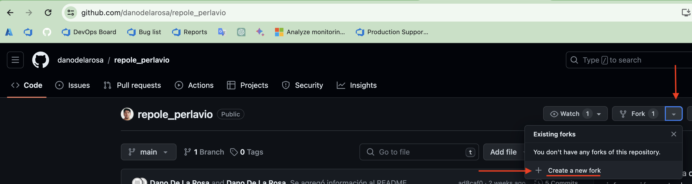
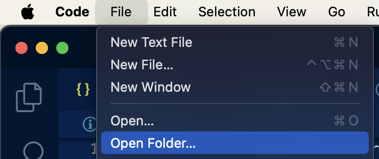

## REPOsirotio LEgal Para ERradicar LA VIOlencia
Proyecto web para la difusión de información contra las violencias

## Contenido
- [Como aportar al proyecto](#como-aportar-al-proyecto)
- [Como correr el proyecto](#como-correr-el-proyecto)
- [Cosas por hacer](#cosas-por-hacer)

# Como aportar al proyecto
1. Hacer un fork de este proyecto en tu cuenta


1. Abrir una terminal y clonar el fork que se acaba de hacer
    ```bash
    git clone https://github.com/tu_usuario/tu_fork.git
    ```
2. Abrir el proyecto recien clonado/descargado
   - Usando la consola
     ```bash
     cd /path/del/proyecto
     ```
   - Usando un editor de código como [Visual Studio Code](https://code.visualstudio.com/download)
     
3. Crear una rama para la feature/tarea a realizar
   ```bash
   git branch feature_de_ejemplo_1
   ```
   \*\*Se deja a concideración de la persona que contribuye al proyecto qué tanto colaboración/código debe de estar dentro de una rama
4. Moverse a la rama recien creada
   ```bash
   git checkout feature_de_ejemplo_1
   ```
   \*\*Los últimos 2 comandos (crear una rama y moverse a la rama recien creada) se pueden ejecutar en una sóla línea usando el siguiente comando
   ```bash
   git checkout -b feature_de_ejemplo_1
   ```


# Como correr el proyecto
1.- Clonar el repositorio
```bash
git clone https://github.com/danodelarosa/repole_perlavio.git
```

# Cosas por hacer